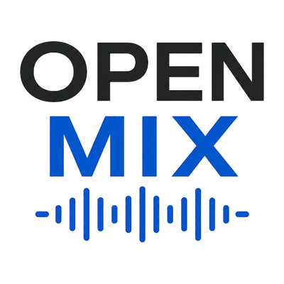

# OPEN MIX



歌ってみたMIXのためのオープンソースエディタ。Electron製、Windows/macOS/Linuxで動作。

## 機能

**マルチトラック編集**
- 複数音声同時ドロップ可
- トラックごと Gain / Pan / Mute / Solo
- Offset / Trim Start / Trim End / Fade In / Fade Out
- リアルタイム音量メーター
- 波形表示・クリックでシーク

**エフェクト（トラックごと）**
- High-pass Filter
- 3-band EQ
- Compressor (Threshold / Ratio / Attack / Release)
- Reverb (procedural IR)

**プロジェクト管理**
- JSON保存/読み込み（Electronではネイティブダイアログ）
- 音声ファイルはファイル名でマッチング

**ピッチ補正**
- YINでフレーム単位ピッチ検出
- カーブを音名グリッド上に可視化
- Scale (Chromatic / Major / Minor / Pentatonic) × Key × Strength
- 位相ボコーダで補正（FFT・位相一貫性維持）

**プラグインシステム**
- トラックごとに任意のプラグインを追加・並び替え・バイパス
- ビルトイン：Saturator / Stereo Widener / Delay / Chorus / Limiter
- プロジェクトJSONに状態保存
- 将来のWASMプラグイン・外部プラグイン受け入れの土台

**書き出し**
- WAV 16bit PCM (OfflineAudioContext)

## キーボードショートカット

| キー | 動作 |
|---|---|
| `Space` | 再生 / 一時停止 |
| `Enter` | 停止 |
| `Home` / `End` | 先頭 / 末尾へ |
| `←` / `→` | -1秒 / +1秒 (Shift押下で5秒) |
| `↑` / `↓` | 上下のトラックを選択 |
| `1`〜`9` | 番号のトラックを選択 |
| `M` | 選択トラックを Mute |
| `S` | 選択トラックを Solo |
| `P` | 選択トラックのピッチ補正を開く |
| `Delete` / `Backspace` | 選択トラックを削除 |
| `Ctrl/Cmd + S` | プロジェクト保存 |
| `Ctrl/Cmd + O` | プロジェクト読み込み |
| `Ctrl/Cmd + E` | WAV書き出し |
| `Ctrl/Cmd + N` | 全クリア |

## 開発環境

```bash
npm install
npm start
```

## ビルド

```bash
npm run build:win     # Windows .exe (NSIS installer + portable)
npm run build:mac     # macOS .dmg (Intel + Apple Silicon)
npm run build:linux   # Linux .AppImage
```

成果物は `dist/` に出力されます。

## 自動ビルド & 配布（GitHub Actions）

`v` で始まるタグを push すると、3OS分のビルドが並行で走り、自動で GitHub Releases にアップロードされます。

```bash
git tag v0.3.0
git push origin v0.3.0
```

`.github/workflows/build.yml` がトリガーされ、`v0.3.0` のリリースに `OPEN-MIX-0.3.0-*.exe / .dmg / .AppImage` が添付されます。

手動実行も可（Actionsタブから `workflow_dispatch`）。

## ファイル構成

```
open-mix/
├── package.json
├── README.md
├── .gitignore
├── .github/workflows/build.yml
├── build/
│   ├── icon.png                  1024x1024 マスター
│   ├── icon.ico                  Windows用マルチサイズ
│   └── icon-16〜512.png          各サイズ
├── electron/
│   ├── main.js
│   └── preload.js
└── renderer/
    ├── index.html
    ├── assets/
    │   ├── favicon.png
    │   └── logo.png
    ├── css/  (9ファイル)
    └── js/   (11ファイル + plugins/)
        ├── main.js
        ├── app.js                + キーボード処理
        ├── engine.js
        ├── track.js              + プラグインチェーン
        ├── track-view.js
        ├── plugin-chain-view.js
        ├── project.js
        ├── pitch.js              位相ボコーダ
        ├── pitch-view.js
        ├── utils.js
        ├── wav.js
        └── plugins/
            ├── base.js
            ├── registry.js
            ├── saturator.js
            ├── widener.js
            ├── delay.js
            ├── chorus.js
            └── limiter.js
```

## ピッチ補正の品質について

位相ボコーダ（FFT・位相一貫性維持）実装。FFTビンシフトの単純実装より明確に改善していますが、Melodyne級ではありません。

- 強み：単音ボーカル、小〜中の補正幅
- 弱み：子音の歪み、強い補正でロボット感、ポリフォニックは未対応
- 改善余地：rubberband / SoundTouch ネイティブモジュール統合、PSOLAアルゴリズム

## プラグインシステム

トラックごとにプラグインチェーンを構築できます。FXラック内の Plugin Chain セクションから追加・並び替え・バイパス・削除が可能で、各プラグインのパラメータはリアルタイムで反映されます。

### ビルトインプラグイン

| ID | 名前 | タグ | 主な用途 |
|---|---|---|---|
| `saturator` | Saturator | SAT | 倍音付加・温度感（tanh waveshaper） |
| `widener` | Stereo Widener | WIDE | M/S処理によるステレオ幅調整 |
| `delay` | Delay | DLY | エコー・空間表現（フィードバック・トーン付き） |
| `chorus` | Chorus | CHO | LFO変調3voice、声の厚み |
| `limiter` | Limiter | LIM | ピーク制御・マスタリング用 |

### プラグインAPI

新規プラグインは `renderer/js/plugins/` に `*.js` を追加し、`registry.js` に登録するだけで使えます。

```js
export const MyPlugin = {
  id: 'my-plugin',
  name: 'My Plugin',
  tag: 'MY',
  paramDefs: [
    { name: 'amount', label: 'Amount', min: 0, max: 1, default: 0.5, step: 0.01,
      format: v => Math.round(v * 100) + '%' },
  ],
  defaults() { return Object.fromEntries(this.paramDefs.map(p => [p.name, p.default])); },
  build(ctx, params) {
    const input = ctx.createGain();
    const output = ctx.createGain();
    return { input, output };
  },
  applyParam(nodes, name, value) {  },
};
```

プラグインは `{ input, output }` という最小契約を返せばよく、内部の構造は自由です。`build()` は AudioContext / OfflineAudioContext の両方で呼び出されるため、再生・書き出しの両方で同じ音になります。

### VST3対応について

現状未対応。実装には VST3 SDK (C++) の Native Module 化、AudioWorklet と plugin host の橋渡し、プラグインウィンドウ管理（Electron BrowserWindow とは別系統）が必要で、数ヶ月単位の専用プロジェクトになるため別ブランチで進める想定です。上記プラグインシステムはその受け入れ準備として設計されています。

## ライセンス

MIT License（詳細は `LICENSE` ファイル参照）

- 個人・商用利用、自由
- 改変・再配布、自由
- OPEN MIX を使って制作した楽曲・MIX 作品の権利はすべて制作者に帰属
- クレジット表記不要
